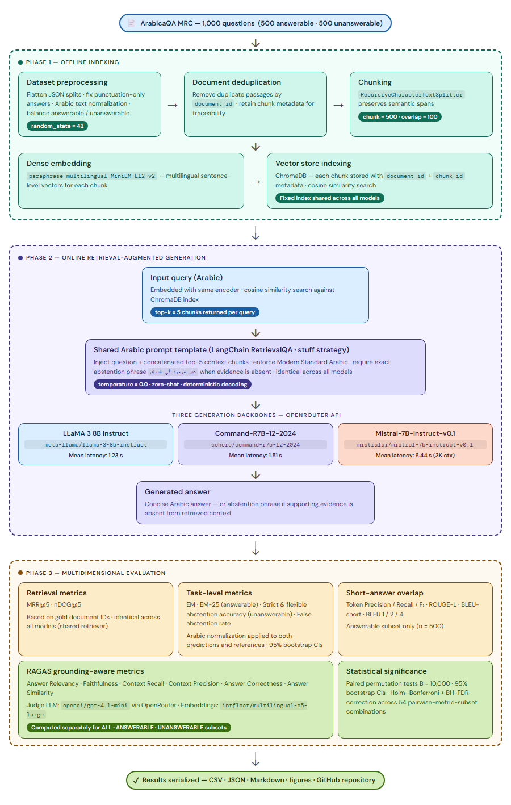

# Arabic RAG Evaluation with RAGAS (ArabicaQA) - LLaMA-3 vs Mistral vs Command-R7B

This repository provides the implementation and evaluation pipeline for the paper:

> A Comparative Study of LLM-Based Retrieval-Augmented Generation for Arabic Question Answering

It benchmarks a fixed Retrieval-Augmented Generation (RAG) setup on **ArabicaQA**, comparing three instruction-tuned LLMs under identical retrieval conditions via **OpenRouter**:

- **LLaMA-3 (8B)** (`meta-llama/llama-3-8b-instruct`)
- **Mistral-7B-Instruct** (`mistralai/mistral-7b-instruct-v0.1`)
- **Command-R7B** (`cohere/command-r7b-12-2024`)

Evaluation includes classic QA metrics, retrieval ranking metrics, **RAGAS** grounding-aware metrics, and statistical significance analysis with multiple-comparisons correction.

The pipeline is organized as six sequential notebooks (`00` through `05`); see [Pipeline / Notebook Order](#pipeline--notebook-order) below for what each one does and must be run in order.

---

## Project Structure

```text
├── 00_dataset-load_statis.ipynb
├── 01_sample_sample-statis.ipynb
├── 02_RAG.ipynb
├── 03_EM_EM25_ans-abstention-rate.ipynb
├── 04_RAGAS_statistical-analysis.ipynb
├── 05_extra-metrics.ipynb
├── Old_ArabicaQA_RAG_Eval_OpenRouter.ipynb   # superseded monolithic version, kept for reference only
├── requirements.txt
├── .env                          # OPENROUTER_API_KEY (not committed)
├── LICENSE
├── DATASET_LICENSE
├── README.md
│
└── arabicaqa_rag_results
    ├── dataset
    ├── diagnostics
    ├── predictions
    │   └── figures_strict_flexible
    ├── statistical_analysis
    ├── ragas_full
    │   ├── figures
    │   └── figures_full
    ├── ragas_full_llama_mistral_command
    │   ├── ci_analysis
    │   └── figures
    └── extra_metrics_llama_mistral_command
        └── figures
```

### Directory Description

- `dataset/` — full ArabicaQA data structure (MRC, OpenQA) and processed evaluation subsets (e.g., 1000-example balanced sample), including intermediate analysis files.
- `diagnostics/` — data integrity checks (gold answer validation, unanswerable label audits).
- `predictions/` — model outputs, retrieved contexts, EM/EM25 scores, and abstention/refusal rate results.
- `statistical_analysis/` — bootstrap CI tables for EM/EM25/Token-F1 model-level metrics.
- `ragas_full/` — descriptive-statistics figures for the full dataset and the 1,000-question sample (context/question/answer length, foreign-word counts, NER distributions). Despite the folder name, this does not contain RAGAS scores.
- `ragas_full_llama_mistral_command/` — RAGAS evaluation outputs, per-question scores, CI analysis, paired significance tests, and generated figures.
- `extra_metrics_llama_mistral_command/` — extra generation and retrieval metrics (ROUGE-L, BLEU, Token-F1, MRR@K, nDCG@K) and figures.

## Pipeline / Notebook Order

Run the notebooks in this order — each one reads files written by the notebook(s) before it.

1. **`00_dataset-load_statis.ipynb`**
   Loads the raw ArabicaQA MRC JSON splits, flattens them into one dataframe, and computes full-dataset descriptive statistics (lengths, foreign-word counts, NER entity distribution).
   - Reads: `arabicaqa_rag_results/dataset/MRC/{train,validation,test}.json`
   - Writes: `arabicaqa_rag_results/dataset/df_all_mrc.csv`, `.../dataset/full_arabicaQA_MRC_dataset_ner_counts.csv`, figures in `.../ragas_full/`

2. **`01_sample_sample-statis.ipynb`**
   Draws the fixed, seeded 1,000-question evaluation subset (500 answerable + 500 unanswerable) and computes sample-level descriptive statistics.
   - Reads: `arabicaqa_rag_results/dataset/df_all_mrc.csv`
   - Writes: `arabicaqa_rag_results/dataset/df_sample_1000.csv`, `.../dataset/sample_ner_counts.csv`, figures in `.../ragas_full/`

3. **`02_RAG.ipynb`** — *makes paid OpenRouter API calls*
   Builds the Chroma vector index over the sample contexts, retrieves top-k passages, generates answers with all three models via OpenRouter, merges per-model outputs into one comparison file, and runs a gold-answer/answerability integrity check.
   - Reads: `arabicaqa_rag_results/dataset/df_sample_1000.csv`
   - Writes: `arabicaqa_rag_results/predictions/comparison_llama_mistral_command_1000.{csv,json}` (the file every downstream notebook depends on), per-model prediction files, `.../diagnostics/*.csv`

4. **`03_EM_EM25_ans-abstention-rate.ipynb`**
   Computes EM and EM25 (strict + flexible abstention policies), bootstrap CIs and pairwise significance for EM/EM25/Token-F1, and the answerable-abstention rate.
   - Reads: `arabicaqa_rag_results/predictions/comparison_llama_mistral_command_1000.csv`
   - Writes: `.../predictions/final_scores_strict_and_flexible_abstention_corrected.{csv,json,txt,md}`, `.../statistical_analysis/bootstrap_*_corrected.csv`, `.../predictions/answerable_abstention_rate_strict_and_flexible.csv`, figures in `.../predictions/figures_strict_flexible/`

5. **`04_RAGAS_statistical-analysis.ipynb`** — *makes paid OpenRouter API calls (LLM judge)*
   Runs RAGAS grounding metrics (faithfulness, answer relevancy, context precision/recall, answer similarity/correctness), bootstrap CIs, paired bootstrap and permutation significance tests, BH-FDR and Holm corrections, abstention/refusal-rate CIs, and summary figures.
   - Reads: `arabicaqa_rag_results/predictions/comparison_llama_mistral_command_1000.csv`
   - Writes: everything under `.../ragas_full_llama_mistral_command/` (per-model/per-question/summary/NaN/latency tables, `ci_analysis/`, `figures/`)

6. **`05_extra-metrics.ipynb`**
   Computes additional retrieval metrics (MRR@5, nDCG@5) and generation-quality metrics (ROUGE-L, BLEU, token Precision/Recall/F1) not covered by RAGAS, with summary figures and a heatmap.
   - Reads: `arabicaqa_rag_results/predictions/comparison_llama_mistral_command_1000.csv`
   - Writes: everything under `.../extra_metrics_llama_mistral_command/`

---

## Dataset

This work uses the ArabicaQA dataset:
<https://huggingface.co/datasets/abdoelsayed/ArabicaQA>

## System Overview



```text
Question
   |
   v
Retriever (MiniLM + Chroma)
   |
   V
Top-k Context
   |
   V
LLM (LLaMA-3 / Mistral / Command-R7B via OpenRouter)
   |
   V
Answer
   |
   V
Task / Retrieval / RAGAS Evaluation
   |
   V
Statistical Significance Analysis
```

## Method Summary

### RAG pipeline (fixed across models)

1. Load ArabicaQA contexts and questions
2. Chunk contexts into overlapping passages
3. Embed chunks with a multilingual sentence embedding model (paraphrase-multilingual-MiniLM-L12-v2)
4. Store embeddings in a vector DB (Chroma)
5. Retrieve top-*k* passages per query
6. Generate answers using an LLM (OpenRouter backend)
7. Evaluate using:
   - Task metrics (EM, EM25, no-answer accuracy, abstention rate)
   - Lexical overlap metrics (Token-F1, ROUGE-L, BLEU-short)
   - Retrieval metrics (MRR@5, nDCG@5)
   - RAGAS metrics (faithfulness, answer relevancy, context precision/recall, etc.)
   - Statistical significance (paired bootstrap, BH-FDR, Holm correction)

---

## Experimental Configuration

| Component | Value |
| --- | --- |
| Chunk size | 500 |
| Chunk overlap | 100 |
| Embedding model | paraphrase-multilingual-MiniLM-L12-v2 |
| Retriever top-k | 5 |
| Temperature | 0.0 |
| Max tokens | 64 |
| Evaluation subset size | 1000 |
| Answerable / Unanswerable | 500 / 500 |
| Random seed | 42 |
| LLM backend | OpenRouter |

## Installation

### 1) Create environment (recommended)

```bash
python -m venv .venv
source .venv/bin/activate   # macOS/Linux
# .venv\Scripts\activate    # Windows PowerShell
pip install -U pip
```

### 2) Install dependencies

To install dependencies use `requirements.txt`, run:

```bash
pip install -r requirements.txt
```

---

## OpenRouter Setup (LLM Inference)

This project uses [OpenRouter](https://openrouter.ai/) to access LLMs via a unified API.

1. Create a free account at <https://openrouter.ai/>
2. Generate an API key from your dashboard
3. Create a `.env` file in the project root:

```dotenv
OPENROUTER_API_KEY=your_key_here
```

`02_RAG.ipynb` and `04_RAGAS_statistical-analysis.ipynb` load this key automatically via `python-dotenv`. No local model downloads or GPU hardware are required.

---

## How to Run

Launch Jupyter Notebook:

```bash
jupyter notebook
```

Run the notebooks **in numeric order**, top to bottom within each one — every notebook after `01` depends on files written by the notebook(s) before it (see [Pipeline / Notebook Order](#pipeline--notebook-order)):

1. `00_dataset-load_statis.ipynb`
2. `01_sample_sample-statis.ipynb`
3. `02_RAG.ipynb`
4. `03_EM_EM25_ans-abstention-rate.ipynb`
5. `04_RAGAS_statistical-analysis.ipynb`
6. `05_extra-metrics.ipynb`

> **Paid API calls:** `02_RAG.ipynb` (answer generation) and `04_RAGAS_statistical-analysis.ipynb` (RAGAS LLM-judge scoring) both call OpenRouter and incur cost per run. Avoid re-running them unnecessarily — the other notebooks only read the CSV/JSON files these two produce.

### Expected outputs

Depending on your notebook settings, you will typically produce:

- Model predictions (answers) for all three models
- Retrieved contexts per query
- Metric tables (per subset / overall)
- RAGAS score reports (JSON/CSV)
- Bootstrap CI tables (RAGAS metrics, latency, abstention rates)
- Paired significance test results (with BH-FDR and Holm corrections)
- Summary plots

---

## Evaluation Metrics

### Task-level

- **EM** (Exact Match after normalization)
- **EM25**: character-prefix-strip exact match — a prediction is scored correct if it exactly matches a reference answer after stripping 0–25 leading characters from the normalized prediction, tolerating verbose response prefixes common in instruction-tuned models.
- **No-answer accuracy** (for unanswerable subset)
- **Abstention rate** (strict and flexible)
- **Answerable refusal rate** (incorrect abstention on answerable questions)

### Overlap / short-answer metrics

- **Token-F1**
- **ROUGE-L**
- **BLEU-short**

### Retrieval ranking

- **MRR@5**
- **nDCG@5**

### RAGAS (grounding-aware)

- **Faithfulness**
- **Answer Relevancy**
- **Context Precision**
- **Context Recall**
- **Answer Similarity**
- **Answer Correctness**

### Statistical analysis

- **Bootstrap 95% CI** — per metric, per model, per subset (ALL / ANSWERABLE / UNANSWERABLE)
- **Paired bootstrap significance tests** — all model pairs, per metric
- **Benjamini-Hochberg FDR correction** — controls false discovery rate across multiple comparisons
- **Holm correction** — family-wise error rate control

---

## Reproducibility Notes

This repo aims to make comparisons fair by:

- Keeping the retriever fixed across models
- Using consistent chunking / top-k retrieval settings
- Using deterministic generation settings when possible (temperature=0)
- Saving retrieved contexts for consistent scoring
- Using the same OpenRouter API endpoint for all models

To reproduce exactly, ensure:

- Same dataset version / split seed
- Same chunking parameters
- Same embedding model
- Same top-k retrieval value
- Same decoding configuration
- Same OpenRouter model IDs

---

## Results

The paper reports model trade-offs such as:

- stronger lexical overlap / answer matching vs.
- stronger grounding (faithfulness) and abstention behavior

See the paper for full tables, subset analysis (answerable vs unanswerable), RAGAS interpretation, and statistical significance findings.

---

## Citation

If you use this repository, please cite:

```bibtex
@article{almalki_arabicrag_2026,
  title={A Comparative Study of LLM-Based Retrieval-Augmented Generation for Arabic Question Answering},
  author={Zohoor Almalki,Shahad Alshehri, Shatha Alrehaili, Amjad Althagafi, and Mourad Mars},
  year={2026}
}
```

---

## Known Limitations

- Fixed dense retriever (no hybrid or reranking)
- Deterministic decoding only (temperature=0)
- Evaluation limited to ArabicaQA
- No human evaluation
- Dependent on OpenRouter API availability and model deprecation schedules (note: `mistralai/mistral-7b-instruct-v0.1` on OpenRouter is scheduled for deprecation May 30, 2026)

## Compute Infrastructure

### Local Development Environment

- OS: Microsoft Windows 11 Home
- System Model: WRTB-WXX9
- CPU: Intel Core i7-10510U @ 1.80GHz
- RAM: 16 GB
- Python: 3.10.19

This environment was used for RAG pipeline development, retrieval experiments, and dataset analysis.

---

### LLM Inference

LLM inference for all three models (LLaMA-3, Mistral, Command-R7B) was performed via the **OpenRouter API** — no local GPU is required.

---

### Cloud Execution (RAGAS Evaluation)

RAGAS evaluation was executed on **Lambda Cloud** using:

- GPU: NVIDIA A100
- Instance type: Single-GPU configuration
- OS: Ubuntu (Lambda default image)
- Session management: tmux
- Total runtime: ~15h 59m
  - ~14–15h RAGAS evaluation
  - ~1–2h setup and execution management

Long-running jobs were managed via terminal session multiplexing (tmux) to ensure uninterrupted execution in the event of SSH or network disconnections.

During the final execution phase, the internet connection was interrupted, which prevented output from streaming to the interactive notebook interface. However, because the job was running inside a tmux session on the Lambda server, execution completed successfully and all outputs were generated and saved.

## Acknowledgments

This research was supported by **Umm Al-Qura University** (Grant Number: **26UQU44680217GSSR02**).

---

## License

### Code

The source code in this repository is licensed under the terms of the included LICENSE file.

### Dataset License

This work uses the ArabicaQA dataset.
The original dataset license is provided in DATASET_LICENSE.
